# Actions

## View current work item links
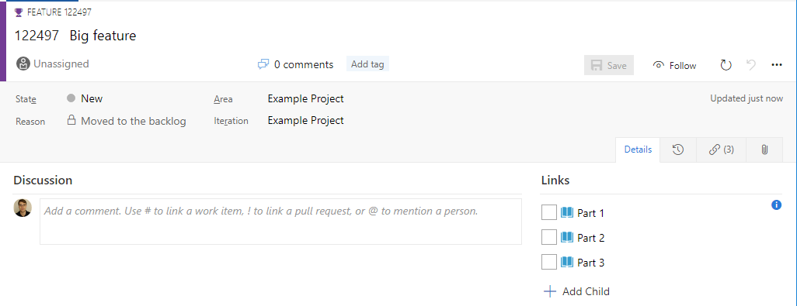
## Add a child a work item
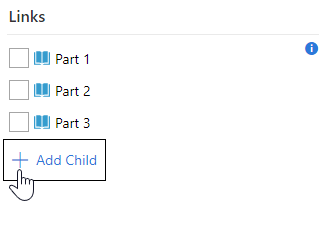
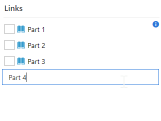  
Press Enter or exit focus to save. Press Esc or clear title to cancel.  
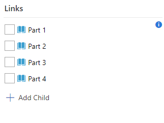
## Rename the work item
Click options -> rename or select then F2  
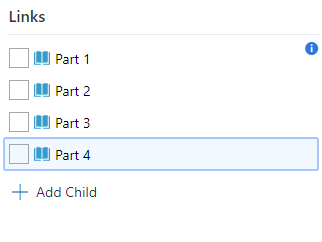
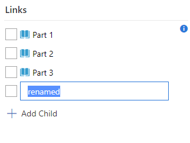  
Press Enter or exit focus to save new title. Press Esc to cancel  
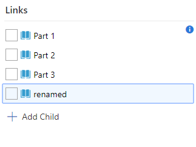

## Reorder linked work items
Shift + (⬆ / ⬇)  
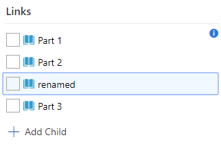

## Delete linked work items
Click options -> delete or select then press Del  
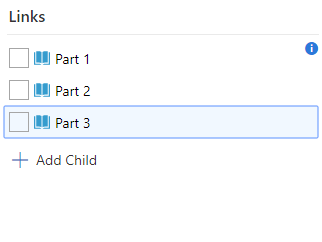

## Unlink linked work items
Click options -> Unlink or select then press Ctrl + U  
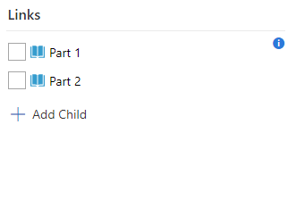  
Then save the work item to confirm link removal

# Why?
To make the functionality available on the board available in the work item form  
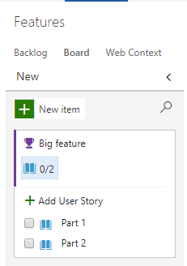


# Configuration with on Team Services 

To configure where the board group is added click on the customize option from the work item form.  
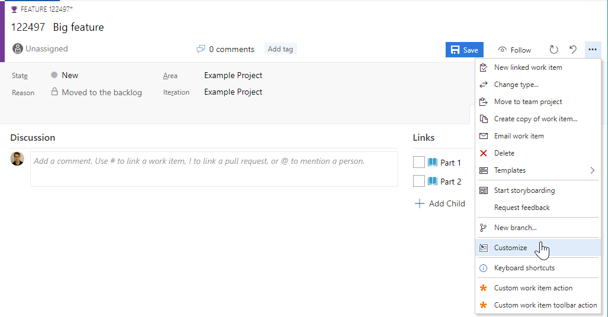  
Then drag the group where desired or hide it.  
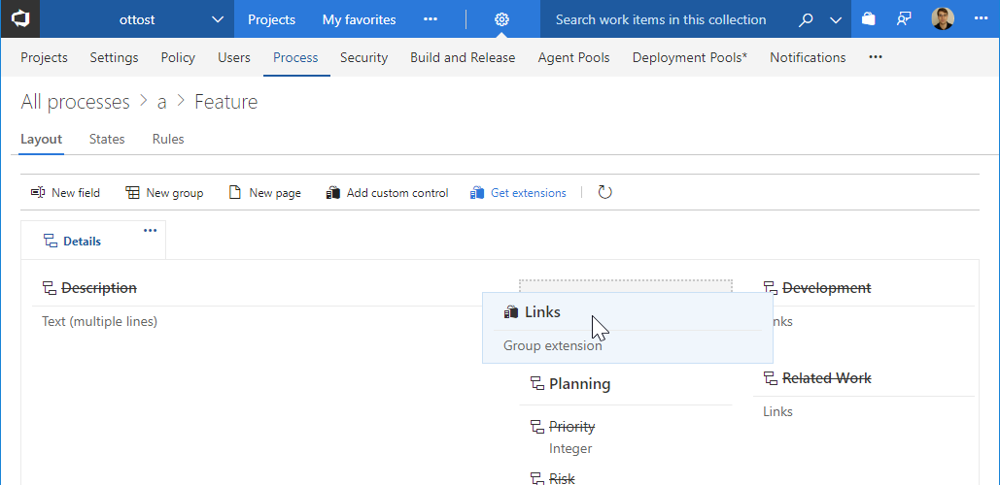

# Configuration using process template

Navigate the process template xml.
For each work item type to customize at the location 
```xpath
/WITD/WORKITEMTYPE/FORM/WebLayout/Extensions
```
add 
```xml
<Extension Id="ottostreifel.links-group" />
```
Within the same Weblayout choose a Section element and add
```xml
<GroupContribution Label="Board" Id="ottostreifel.links-group.links-group"/>
```


# Change Log
(03/20/17) 1.0.1 Initial release
